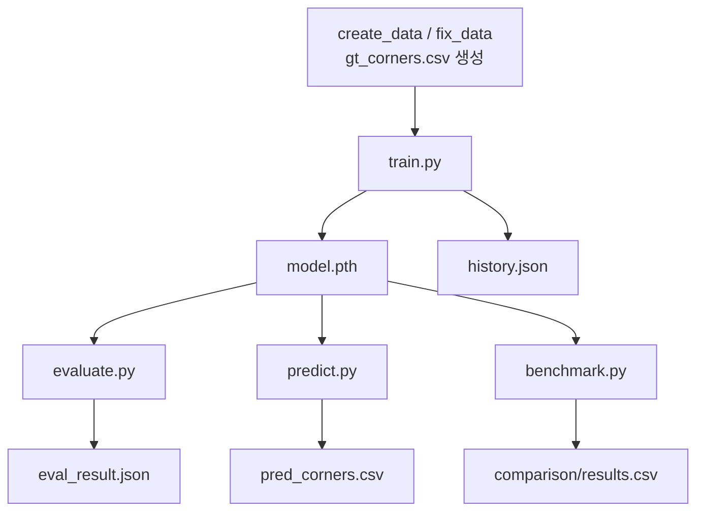
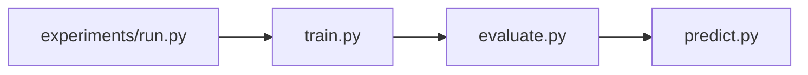

# ROI Corner Detection CLI 사용 가이드

## 1. 개요

이 문서는 `scripts/`의 CLI 스크립트와 `experiments/run.py` 배치 러너를 사용해 학습부터
방법론 비교까지 실험을 수행하는 방법을 상황별로 정리한 운영 매뉴얼이다. 각 인수의
정의와 모듈 시그니처는 `README.md` 7-8절(SSOT)에 있으며, 이 가이드는 그 명령을 어떤
순서와 조합으로 사용하는지에 초점을 둔다. 데이터셋 라벨링과 CSV 스키마 근거는
`common/roi-corner-detection-data-pipeline.md`가 담당한다.

대상 독자는 이미 준비된 `gt_corners.csv`를 가지고 특정 방법론을 학습, 평가, 추론,
비교하려는 사용자이다. 모든 명령은 프로젝트 루트에서 실행하며, 실행 환경은 conda
환경 `pytorch_env`를 전제로 한다.

현재 dispatch가 구현된 방법론은 `direct` 하나이며, 이 가이드의 모든 예시는 `direct`를
기준으로 한다. 다른 방법론(`seg`, `detect`, `heatmap`, `hybrid`, `line`, `doc`,
`homography`, `foundation`, `gcn`)은 구현이 완료되면 `--method` 값만 바꿔 동일한 방식으로
사용한다.

## 2. 실행 모델 개요

실험 파이프라인은 네 개의 CLI 스크립트와 하나의 배치 러너로 구성된다. 각 스크립트는
방법론과 무관하게 동일한 인수 집합을 공유하며, 산출물을 `outputs/<method>/<exp_name>/`
아래에 저장한다. 스크립트 간 데이터 흐름은 다음과 같다.



배치 러너 `experiments/run.py`는 위 스크립트 중 `train.py`, `evaluate.py`, `predict.py`를
`CONFIGS` 전체 조합에 대해 순차 호출한다.



모든 스크립트가 공유하는 주요 인수는 다음과 같다. 전체 인수 정의는 `scripts/config.py`의
`parse_args()`에 있다.

| 인수 | 타입 | 기본값 | 설명 |
|---|---|---|---|
| `--method` | str | `direct` | 방법론 코드 |
| `--device` | str | `None` | 생략 시 자동 선택, `cpu`/`cuda` 지정 가능 |
| `--batch_size` | int | `4` | 배치 크기 |
| `--max_epochs` | int | `10` | 학습 에폭 수 |
| `--num_workers` | int | `4` | DataLoader 워커 수 |
| `--train_size` | int | `20000` | train 표본 수 (`None`이면 전체) |
| `--valid_size` | int | `1000` | valid 표본 수 |
| `--test_size` | int | `1000` | test 표본 수 |
| `--save` | flag | `False` | 산출물 저장 여부 |
| `--checkpoint` | str | `None` | 체크포인트 경로 (미지정 시 자동 계산) |
| `--output_dir` | str | `None` | 산출물 경로 (미지정 시 `outputs/<method>/<exp_name>`) |

`csv_path`, `image_size`, `seed`는 CLI 인수가 아니라 `DEFAULTS`에서 직접 읽으므로 CLI로
오버라이드할 수 없다. 값을 바꾸려면 `scripts/config.py`의 `DEFAULTS`를 수정한다.

실험 이름 `exp_name`은 `scripts/config.py`의 `get_experiment(cfg)`가
`<method>_bs<batch_size>_ep<max_epochs>` 형식으로 생성한다(예: `direct_bs4_ep10`).
`--output_dir`을 지정하지 않으면 산출물 경로는 `get_output_dir`이 계산하는
`outputs/<method>/<exp_name>`으로 결정되고, `--checkpoint`을 지정하지 않으면 체크포인트
경로는 그 아래 `model.pth`가 된다. 따라서 같은 방법론이라도 `batch_size`나 `max_epochs`가
다르면 서로 다른 하위 폴더에 저장되어 실험 간 산출물이 보존된다.

## 3. 전제: 데이터 준비

학습을 시작하려면 `gt_corners.csv`가 준비되어 있어야 한다. 원본 데이터셋을 CSV로
변환하고 코너 순서를 정규화하는 두 스크립트만 간단히 소개하며, 상세 근거는
`common/roi-corner-detection-data-pipeline.md`를 참조한다.

```text
python scripts/create_data.py --dataset smartdoc --data_dir <raw_dir> --output_path data/smartdoc/gt_corners.csv
python scripts/fix_data.py data/smartdoc/gt_corners.csv data/midv2020/gt_corners.csv
```

`scripts/config.py`의 `DEFAULTS["csv_path"]`가 학습에 사용할 CSV 경로 목록을 가리키므로,
생성한 CSV 경로가 이 목록과 일치하는지 확인한다.

## 4. 단일 방법론 워크플로우

하나의 방법론을 학습하고 평가한 뒤 추론까지 수행하는 기본 흐름이다. 세 스크립트는
같은 `outputs/<method>/<exp_name>/` 디렉터리를 공유하므로, `--checkpoint`을 명시하지 않아도
앞 단계가 저장한 체크포인트를 자동으로 이어받는다. 다만 `exp_name`이 `batch_size`와
`max_epochs`에서 파생되므로, evaluate와 predict를 학습과 같은 폴더로 연결하려면 train과
동일한 `--batch_size`, `--max_epochs`를 지정하거나 `--checkpoint`을 직접 지정해야 한다.

### 4.1. 학습 (train.py)

`train.py`는 train/valid 로더를 구성하고 `Trainer.fit`으로 학습한 뒤, `--save` 지정 시
체크포인트와 학습 이력을 저장한다.

```text
python scripts/train.py --method direct --max_epochs 10 --save
```

생성 산출물은 다음과 같다.

| 파일 | 내용 |
|---|---|
| `outputs/direct/direct_bs4_ep10/model.pth` | 학습된 모델 가중치 |
| `outputs/direct/direct_bs4_ep10/history.json` | epoch별 train/valid 손실 및 메트릭 이력 |

`--save`를 생략하면 학습만 수행하고 아무것도 저장하지 않으므로, 파이프라인 점검 목적이
아니라면 `--save`를 함께 지정한다.

### 4.2. 평가 (evaluate.py)

`evaluate.py`는 체크포인트를 로드해 test 로더에서 메트릭을 계산한다. `--checkpoint`을
지정하지 않으면 `outputs/<method>/<exp_name>/model.pth`를 자동으로 사용하므로, 학습과 같은
`--batch_size`, `--max_epochs`를 지정해야 같은 폴더를 가리킨다.

```text
python scripts/evaluate.py --method direct --max_epochs 10 --save
python scripts/evaluate.py --method direct --checkpoint outputs/direct/direct_bs4_ep10/model.pth --save
```

`--save` 지정 시 메트릭 결과를 `outputs/direct/direct_bs4_ep10/eval_result.json`에 저장한다.
메트릭 정의는 `common/roi-corner-detection-metrics.md`를 참조한다.

### 4.3. 추론 (predict.py)

`predict.py`는 체크포인트를 로드해 test 로더 전체에 대한 예측 코너를 CSV로 기록한다.

```text
python scripts/predict.py --method direct --max_epochs 10 --save
```

산출물은 `outputs/direct/direct_bs4_ep10/pred_corners.csv`이며, 컬럼은
`image_dir, image_name, x1, y1, x2, y2, x3, y3, x4, y4`이고 좌표는 [0, 1]로 정규화된다.
이 CSV는 예측 시각화나 정성 분석의 입력으로 사용한다.

## 5. 배치 실행 (experiments/run.py)

`experiments/run.py`는 `scripts/config.py`의 `CONFIGS` 리스트에 정의된 방법론/하이퍼파라미터
조합에 대해 CLI 스크립트를 subprocess로 순차 호출하는 배치 러너이다. `CONFIGS`는
`benchmark.py`와 공유되어 학습과 비교가 같은 실험 목록을 바라보게 한다. 각 실행에는
`--save`가 자동으로 포함되어 산출물이 저장된다. 한 조합이 실패해도 다음 조합으로
진행하며, 각 mode가 끝날 때 성공/실패를 요약해 출력한다.

### 5.1. 전체 순차 실행 (--mode all)

`--mode all`(기본값)은 각 mode를 `train -> evaluate -> predict` 순서로 실행한다. 각 mode
안에서 `CONFIGS`의 모든 조합을 순회한다.

```text
python experiments/run.py
python experiments/run.py --mode all
```

### 5.2. 단계 선택 실행

특정 단계만 다시 돌리려면 mode를 지정한다. 예를 들어 학습을 마친 뒤 추론 결과만 다시
생성하려면 `predict`만 실행한다.

```text
python experiments/run.py --mode train
python experiments/run.py --mode evaluate
python experiments/run.py --mode predict
```

### 5.3. CONFIGS 편집

실행할 방법론과 하이퍼파라미터는 `scripts/config.py`의 `CONFIGS` 리스트에서 dict로
정의한다. `method`는 필수이고, 산출물 경로가 `get_experiment`으로 파생되므로 `batch_size`,
`max_epochs`도 함께 지정한다. 나머지 키(`device`, `num_workers`, `train_size`,
`valid_size`, `test_size`, `checkpoint`, `output_dir`)는 있으면 해당 CLI 인수로 전달되고
없으면 스크립트 기본값을 따른다. `run.py`와 `benchmark.py`가 이 리스트를 함께 참조한다.

```text
CONFIGS = [
    {"method": "direct", "batch_size": 4, "max_epochs": 10},
    {"method": "seg", "batch_size": 8, "max_epochs": 20},
]
```

## 6. 방법론 비교 (benchmark.py)

`benchmark.py`는 `scripts/config.py`의 `CONFIGS` 리스트를 순회하며 각 config의 체크포인트를
동일한 test 세트에서 평가하고, 메트릭과 함께 모델 크기, 파라미터 수, 추론 지연을 하나의
표로 모은다.

```text
python scripts/benchmark.py
```

각 config의 `outputs/<method>/<exp_name>/model.pth` 체크포인트가 없거나 wrapper가 아직
구현되지 않은 방법론은 자동으로 skip한다. 결과는 `outputs/comparison/results.csv`에
저장되며, 주요 컬럼은 다음과 같다.

| 컬럼 | 내용 |
|---|---|
| `experiment` | 실험 이름 (`<method>_bs<batch_size>_ep<max_epochs>`) |
| `method` | 방법론 코드 |
| 메트릭 컬럼 | Polygon IoU, MCD, MaxCD 등 평가 메트릭 |
| `cpu_latency_ms` | CPU 추론 지연 |
| `gpu_latency_ms` | GPU 추론 지연 (CUDA 미가용 시 NaN) |
| `params` | 파라미터 수 |
| `size_mb` | 모델 크기 (MB) |

전형적인 순서는 여러 방법론을 `experiments/run.py`로 학습, 추론까지 끝낸 뒤
`benchmark.py`로 비교표를 생성하는 것이다.

## 7. 유스케이스 시나리오

상황별로 자주 쓰는 명령 조합을 정리한다. 예시는 `direct` 기준이며, 다른 방법론은
`--method` 값만 바꾼다.

UC1. 새 방법론을 처음부터 학습하고 평가한다. evaluate가 같은 실험 폴더를 찾도록 train과
동일한 `--max_epochs`를 준다.

```text
python scripts/train.py --method direct --max_epochs 10 --save
python scripts/evaluate.py --method direct --max_epochs 10 --save
```

UC2. 이미 학습된 모델로 추론 결과 CSV만 다시 생성한다. 학습에 사용한 것과 같은
`--batch_size`, `--max_epochs`를 지정해 해당 실험 폴더의 체크포인트를 가리킨다.

```text
python scripts/predict.py --method direct --max_epochs 10 --save
```

UC3. 파이프라인이 끊김 없이 도는지 짧게 점검한다. 표본 수를 크게 줄여 빠르게 한 번
돌려 본다.

```text
python scripts/train.py --method direct --max_epochs 1 --train_size 32 --valid_size 16 --save
python scripts/evaluate.py --method direct --max_epochs 1 --test_size 16 --save
```

UC4. 여러 방법론을 일괄 학습, 추론한 뒤 비교표를 만든다. `scripts/config.py`의
`CONFIGS`에 방법론을 추가한 다음 실행한다. `run.py`와 `benchmark.py`가 같은 `CONFIGS`를
참조하므로 학습한 실험이 그대로 비교 대상이 된다.

```text
python experiments/run.py --mode all
python scripts/benchmark.py
```

UC5. 특정 체크포인트나 출력 경로를 지정해 실행한다. `--output_dir`을 주면 exp_name 하위
폴더 대신 지정한 경로를 그대로 사용한다.

```text
python scripts/evaluate.py --method direct --checkpoint outputs/direct/direct_bs4_ep10/model.pth --output_dir outputs/direct_eval --save
```

UC6. 자원 상황에 맞춰 device나 배치 크기를 조정한다.

```text
python scripts/train.py --method direct --device cpu --batch_size 2 --save
python scripts/train.py --method direct --device cuda --batch_size 16 --save
```

## 8. 산출물과 경로 정리

각 스크립트가 `--save` 지정 시 생성하는 산출물과 경로는 다음과 같다.

| 스크립트 | 산출물 | 경로 |
|---|---|---|
| `train.py` | 모델 가중치 | `outputs/<method>/<exp_name>/model.pth` |
| `train.py` | 학습 이력 | `outputs/<method>/<exp_name>/history.json` |
| `evaluate.py` | 평가 메트릭 | `outputs/<method>/<exp_name>/eval_result.json` |
| `predict.py` | 예측 코너 | `outputs/<method>/<exp_name>/pred_corners.csv` |
| `benchmark.py` | 비교표 | `outputs/comparison/results.csv` |

여기서 `<exp_name>`은 `<method>_bs<batch_size>_ep<max_epochs>`이다(예: `direct_bs4_ep10`).

각 스크립트는 실행 로그를 `get_logger`를 통해 터미널에 출력하고, `output_dir`이 설정되면
동일 디렉터리의 `run.log`에도 기록한다. `history.json`은 학습 곡선 시각화, `pred_corners.csv`는
예측 시각화, `eval_result.json`과 `results.csv`는 정량 비교의 입력으로 노트북에서 소비한다.

## 9. 문제 해결

CLI 사용 중 자주 마주치는 상황과 대응이다.

`NotImplementedError: method not yet implemented`. dispatch가 구현되지 않은 방법론을
`--method`로 지정했을 때 발생한다. 현재는 `direct`만 사용 가능하며, 다른 방법론은 구현
완료 후 사용한다.

체크포인트 없음 오류. `evaluate.py`나 `predict.py`를 학습 전에 실행하면 발생한다. 먼저
`train.py --save`로 `outputs/<method>/<exp_name>/model.pth`를 생성하거나 `--checkpoint`으로
유효한 경로를 지정한다.

실험 폴더 불일치. 산출물 경로가 `outputs/<method>/<exp_name>` 아래로 저장되고 `exp_name`은
`batch_size`, `max_epochs`에서 파생된다. 따라서 evaluate나 predict를 학습과 다른
`--batch_size`, `--max_epochs`로 실행하면 다른 폴더를 보게 되어 체크포인트를 찾지 못한다.
학습과 같은 값을 지정하거나 `--checkpoint`을 직접 지정한다.

device 미지정 동작. `--device`를 생략하면 자동 선택된다. CPU를 강제하려면 `--device cpu`,
GPU를 강제하려면 `--device cuda`를 지정한다.

conda 환경 오류. 실행은 `pytorch_env` 환경을 사용한다. `torch_py311_cuda118` 환경은 커스텀
빌드로 인해 `torchvision` import 시 연산자 오류가 발생하므로 사용하지 않는다.
